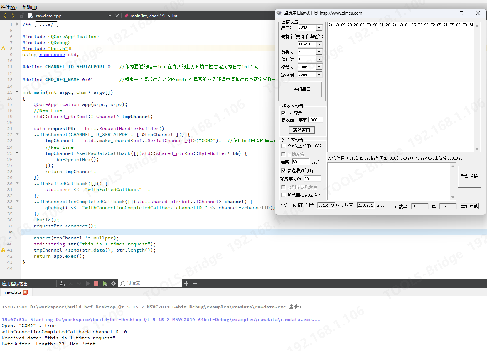

说明
===

此 demo 演示了使用bcf如何收发未经model封装的原始裸流或者二进制数据。但是需要注意：

* 使用requesthandler进行request请求和使用setRawDataCallback进行原始数据流通信是互斥的。
* 即:如果设置了RawDataCallback，则经由requesthandler的请求数据也是从此接口返回。所以，
* 如果不需要使用原始裸流数据了，请给setRawDataCallback接口设置nullptr。则可以恢复到使用协议模型的方式。

