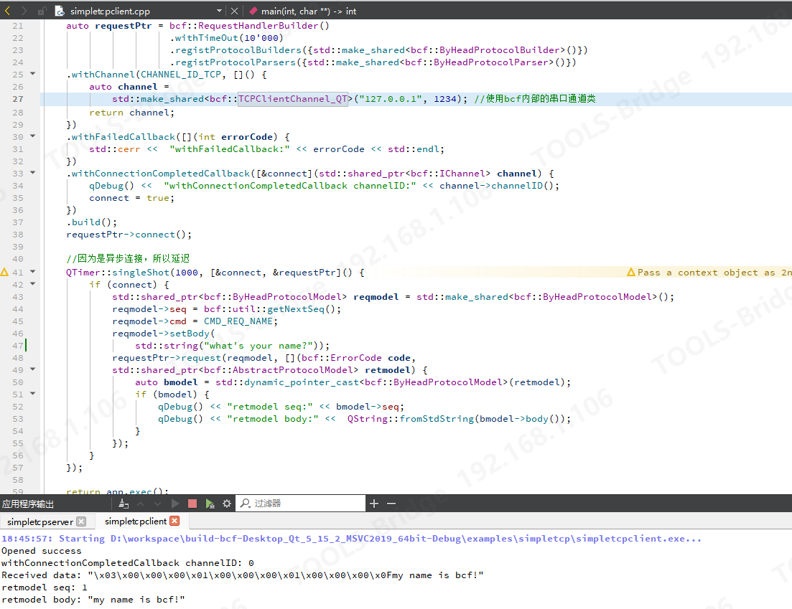
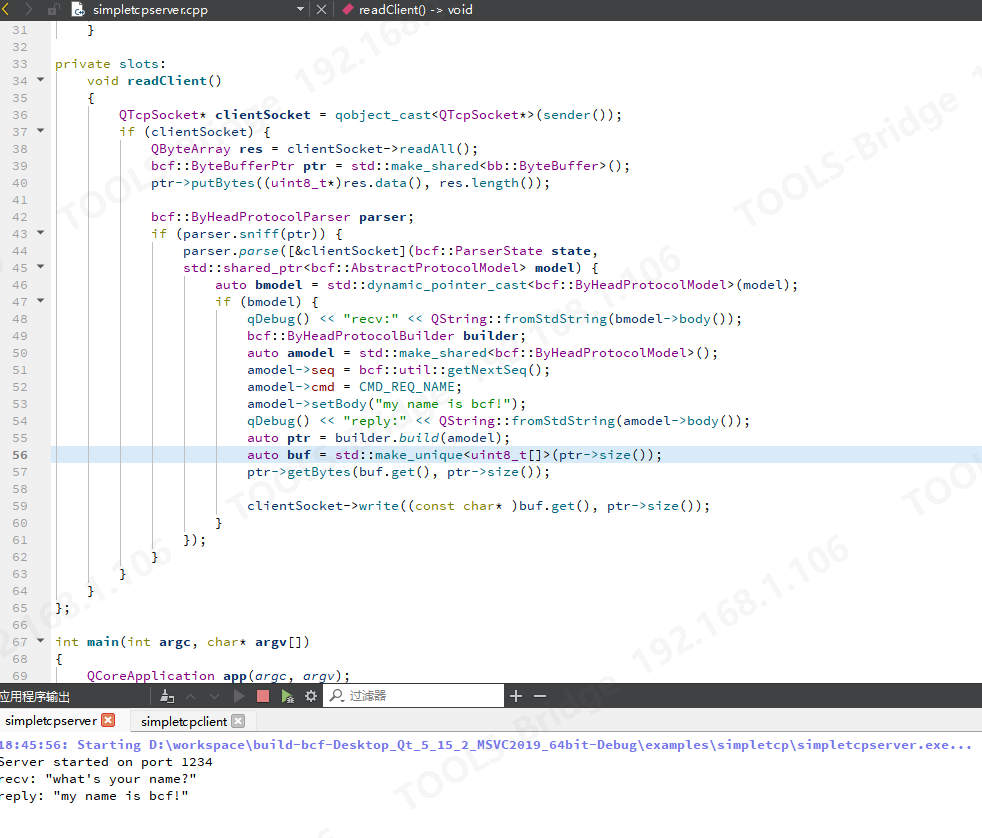

说明
===
客户端：
===
这是最简单的使用bcf tcp的demo。代码中演示了如何使用bcf,结合指定头部长度协议进行tcp连接和发送一次tcp请求。

服务端：
===
bcf 内部并不包含tcpserver,正如bcf首页所示,它并不是一个网络库,对于server端而言,因为重要的工作并不是通过什么协议给客户端主动发送消息,而是维护多客户端。

但是为了方便展示client,我们基于QTCPServer在此处创建了一个服务端程序,为了统一使用bcf内部协议的编码与解码,将 byheadprotocol.h 头文件引了过来，利用这个头文件实现给客户端回复被model封装的消息体和处理可能的粘包问题.

---

先运行simpletcpserver,然后再运行simpletcpclient，就可以看到图中打印的日志了。

client:

server:

