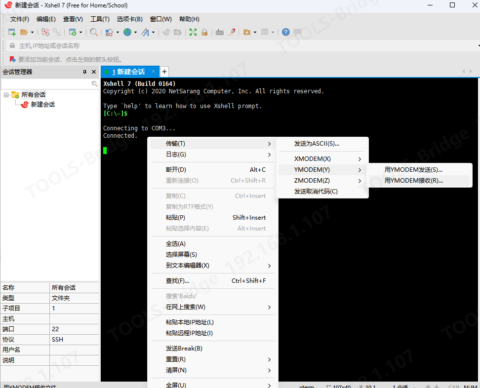
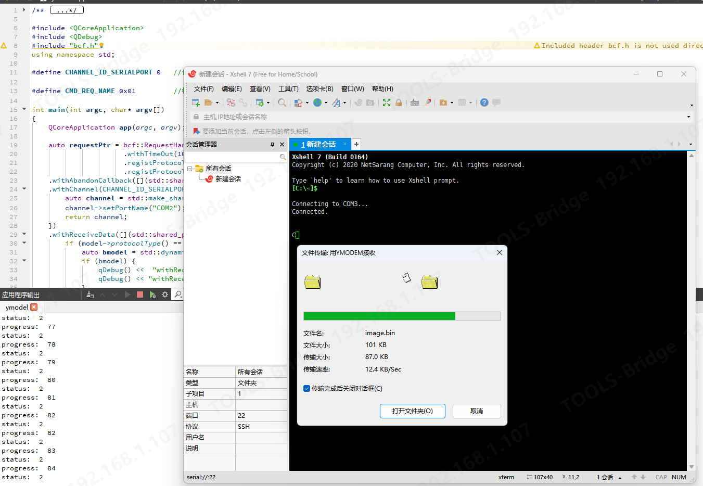

先运行ymodel可执行程序，此时程序一直打印status:0

然后再如图ymodel-2.png运行xshell，并选择“用ymodel”接收，便能看到图ymodel-1.png所示的传输过程，文件传输完成后，程序打印：

```C++
progress:  100
status:  2
status:  2
status:  3
cleanUp:StatusFinish
```




