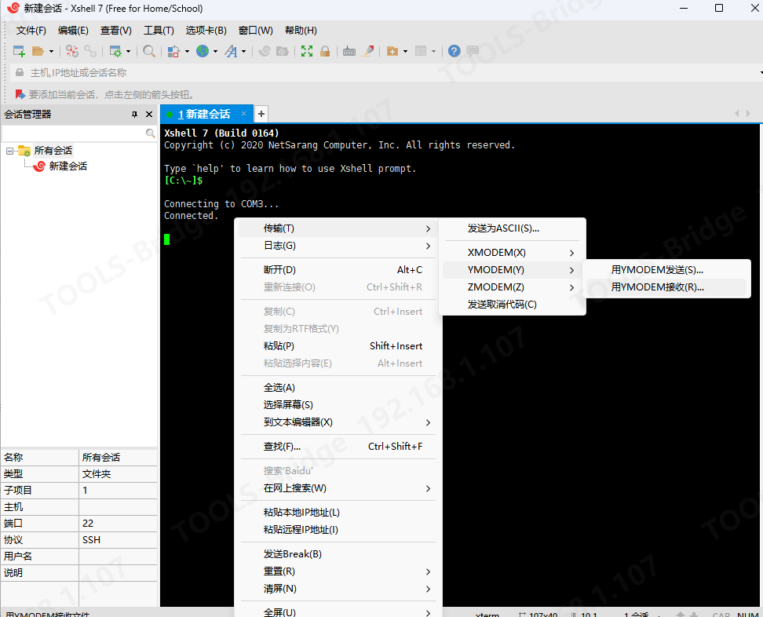
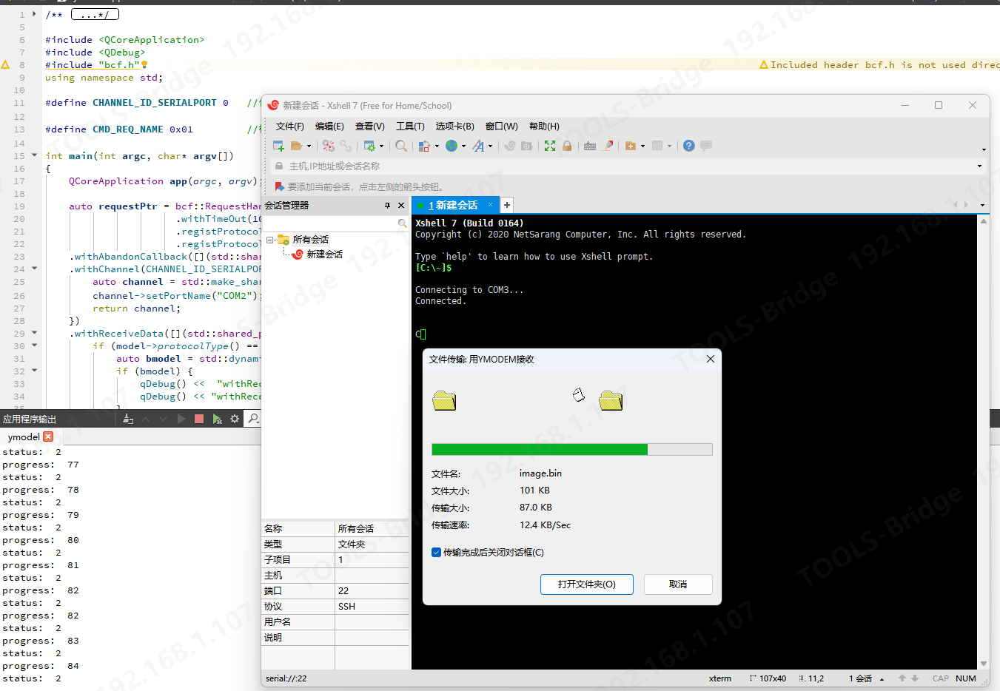
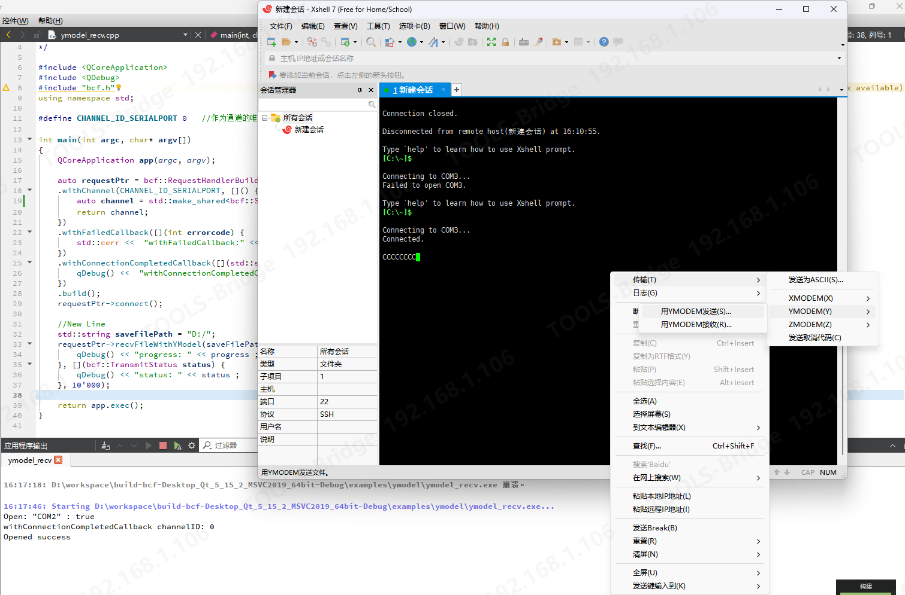
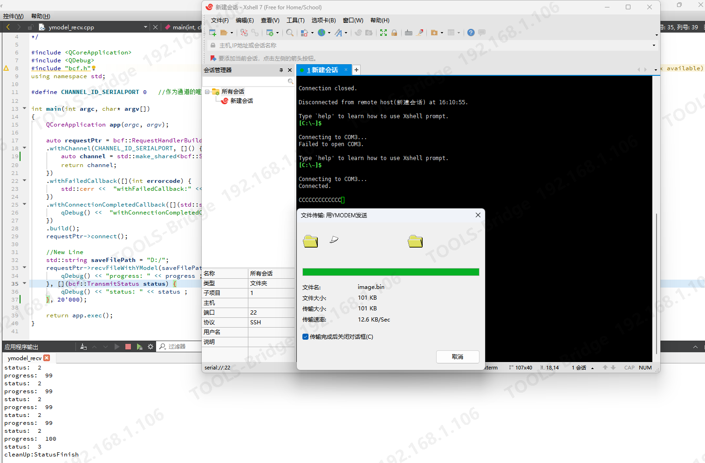

说明
===

**使用Ymodel测试给Xshell发送文件:**

---

先运行 ymodel_send 可执行程序（默认打开COM2）将ymodel_send.cpp中默认发送的filename修改为你自己的文件路径，此时程序一直打印status:0

然后再如图ymodel_send-2.png运行xshell(打开COM3)，并使用虚拟串口配对，然后选择“用ymodel”接收，便能看到图ymodel_send-1.png所示的传输过程，文件传输完成后，程序打印：

```C++
progress:  100
status:  2
status:  2
status:  3
cleanUp:StatusFinish
```






**使用Ymodel协议接收来自Xshell的文件:**

---

先运行 ymodel_recv 可执行程序（将ymodel_recv.cpp中要打开的串口改为COM2），然后再如图ymodel_recv-1.png运行xshell(还是打开COM3)，并使用虚拟串口配对，然后选择“用ymodel”发送，选择要发送的文件(建议100kb以内，否则很慢)，便能看到图ymodel_recv-2.png所示的传输过程，文件传输完成后，文件被保存在"D:/"目录，程序打印：




```
progress:  99
status:  2
progress:  100
status:  3
cleanUp:StatusFinish
```


**ymodel_send.cpp 给 ymodel_recv.cpp 互发文件:**

---
先断开xshell中COM3的连接。

然后运行 ymodel_recv 可执行程序（将ymodel_recv.cpp中要打开的串口改为COM3），再运行ymodel_send 可执行程序，将ymodel_send.cpp中要打开的串口改为COM2，将ymodel_send.cpp中默认发送的filename修改为你自己的文件路径，运行两个程序，截图如下：

 
